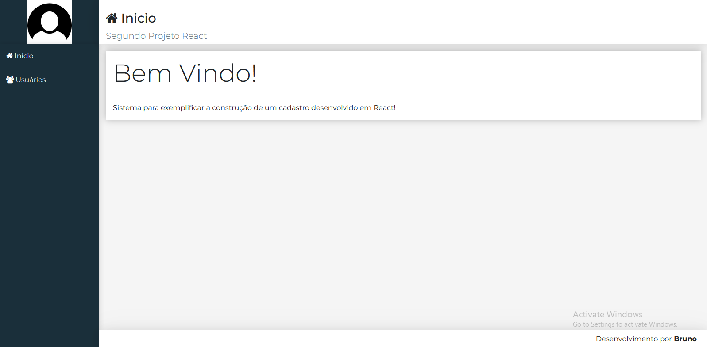

# CRUD

Este projeto é uma aplicação CRUD (Create, Read, Update, Delete) desenvolvida com React, que permite o gerenciamento completo de registros. Ele demonstra o uso prático de hooks, gerenciamento de estado local, comunicação com APIs e componentização.

## 🎯 Objetivo

O objetivo deste projeto é mostrar, de forma clara e funcional, uma interface em React capaz de realizar todas as operações de um sistema CRUD, utilizando boas práticas de desenvolvimento.

### 🔧 Funcionalidades

* ➕ Criar novos registros por meio de um formulário.
* 📄 Visualizar todos os registros em uma tabela ou lista.
* ✏️ Editar registros existentes.
* ❌ Excluir registros com confirmação.
* 💾 Persistência com API REST fake via JSON Server.

### 🛠️ Tecnologias Utilizadas

* [React](https://react.dev/)
* [React Router DOM](https://www.npmjs.com/package/react-router-dom)
* [Axios](https://www.npmjs.com/package/axios)
* [JSON Server](https://www.npmjs.com/package/json-server)
* [CSS](https://react.dev/)

## Dependências e Versões Necessárias

* React - Versão: 18.2.0
* React Router DOM - Versão: 6.8.2
* Axios - Versão: 0.18.0
* JSON Server - Versão: 0.17.2

## Como rodar o projeto ✅

Para executar o projeto, navegue até as pastas backend e frontend individualmente e siga as instruções de instalação e execução em cada uma delas, conforme descrito a seguir:

1. Instalar as dependências
```
npm start
```

2. Inicie o servidor de desenvolvimento:
```
npm start
```

3. Acesse no navegador através da url: http://localhost:3000


